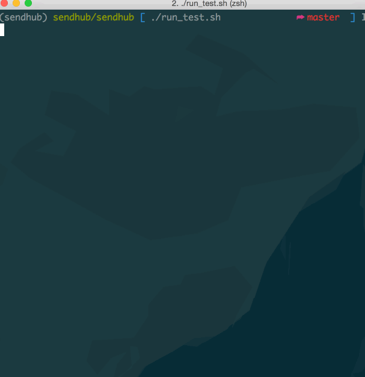

# README

Author: Shen Dong

# Instruction
Run

1. `pip install -r requirements.txt`
2. `python app.py`
3. Send requests to `localhost:8080` with given inputs from pdf file

Run Test Cases (with Nosetests)
1. `chmod +x run_test.sh`
2. `./run_test.sh`

# Demo

App Demo

Test Demo

